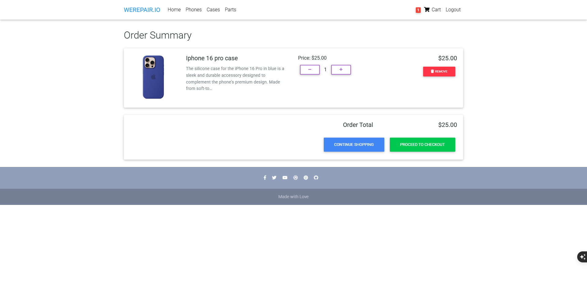
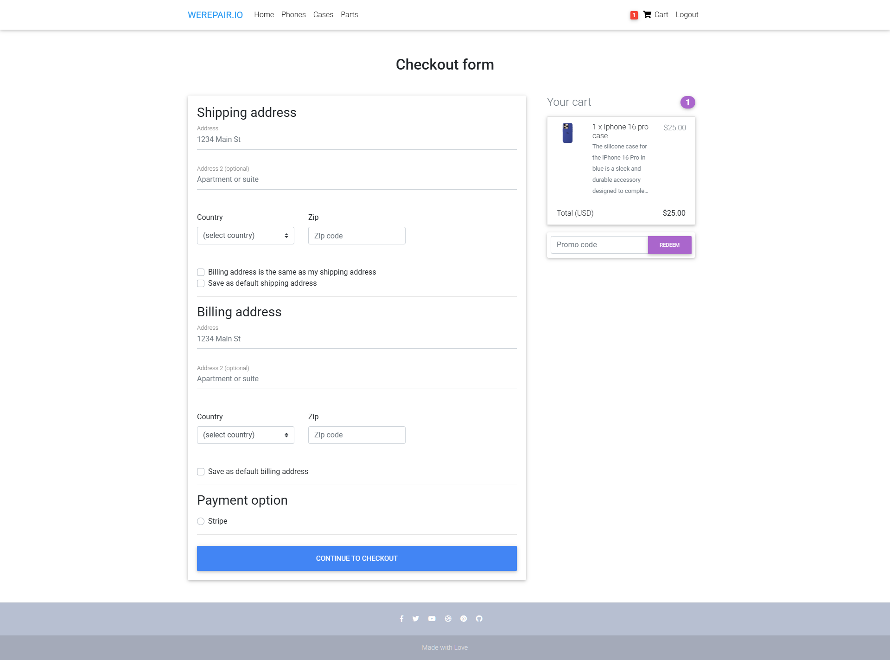
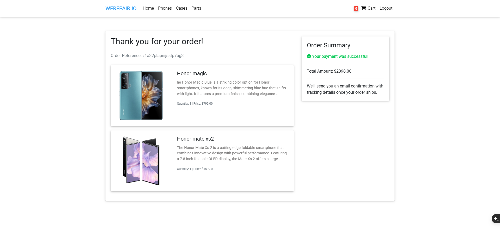

# WEREPAIR.IO

## Description
WEREPAIR.IO is an online platform specializing in selling smartphones, phone cases, and replacement parts. The website provides a seamless shopping experience with categorized product listings, a user-friendly cart system, and secure payment processing. It features a responsive design, ensuring accessibility across desktops, tablets, and mobile devices.

## Features
- **User Authentication**: Secure login and signup functionality.
- **Browse Products by Categories**: Phones, cases, and replacement parts.
- **Add Products to Cart**: Easily add and remove products from the cart.
- **Search and Filtering**: Quick search and advanced filtering options.
- **Order Summary & Checkout**: Review orders before making a purchase.
- **Secure Payments**: Integrated payment gateway for seamless transactions.
- **Mobile-Friendly Design**: Optimized for all screen sizes.
- **Social Media Integration**: Footer with social media links for easy engagement.
- **Performance Optimizations**: Ongoing improvements for faster load times.

## Wireframes
### Desktop Views
<div style="display: flex; gap: 10px;">
    <a href="wireframes/wireframe_home.jpeg">
        
    </a>
    <a href="wireframes/wireframe_Cases.jpeg">
        
    </a>
    <a href="wireframes/wireframe_Phones.jpeg">
        
    </a>
    <a href="wireframes/wireframe_Re_Parts.jpeg">
        
    </a>
</div>

### Tablet & Mobile Views
<div style="display: flex; gap: 10px;">
    <a href="wireframes/wireframe_tablet_home.jpeg">
        
    </a>
    <a href="wireframes/wireframes_mobile_view.jpeg">
        
    </a>
</div>

## Lighthouse Performance Report
Lighthouse results indicate areas of improvement for performance and accessibility:
- **Performance**: 39 (Needs optimization in image loading, caching, and script handling.)
- **Accessibility**: 83 (Good, but enhancements can be made for better readability and contrast.)
- **Best Practices**: 96 (Well-structured but minor improvements possible.)

### Performance Improvements in Progress:
- **Image Optimization**: Implementing lazy loading and compression.
- **Code Splitting**: Reducing unnecessary scripts and improving load times.
- **Caching Strategies**: Enhancing browser caching for faster page loads.
- **Database Queries Optimization**: Reducing redundant queries for better efficiency.

## Database Schema
<a href="wireframes/database_schema.png">
    
</a>

## Color Palette
| Element                | Color Code   |
|------------------------|--------------|
| Primary Navbar/Buttons | `#007BFF`    |
| Background             | `#F8F9FA`    |
| Text (Primary)         | `#212529`    |
| Footer Background      | `#6C757D`    |
| Link Hover             | `#0056B3`    |

<a href="wireframes/Pallet_Colours.png">
    
</a>

## Deployment
The project is deployed on Render and can be accessed at: [WEREPAIR.IO](https://werepair-io.onrender.com/)

## Installation
1. Clone the repository: `git clone https://github.com/username/werepair-io.git`
2. Navigate to the project directory: `cd werepair-io`
3. Install dependencies: `pip install -r requirements.txt`
4. Run the development server: `python manage.py runserver`

## Testing
### Unit Tests
Run all tests using:
```
python manage.py test
```

### Example Test Results
| Test Suite          | Status |
|---------------------|--------|
| User Authentication | Passed |
| Product Filtering   | Passed |
| Footer Links        | Passed |

## Screenshots
### Various Screenshots
<div style="display: flex; flex-wrap: wrap; gap: 10px;">
    <a href="wireframes/home_screen_shot.png">
        
    </a>
    <a href="wireframes/Phones_tab.png">
        
    </a>
    <a href="wireframes/Cases_tab.png">
        
    </a>
    <a href="wireframes/Replacement_parts_tab.png">
        
    </a>
    <a href="wireframes/Sign_in.png">
        
    </a>
    <a href="wireframes/Sign_up.png">
        
    </a>
    <a href="wireframes/product_detail.png">
        
    </a>
    <a href="wireframes/order_summary.png">
        
    </a>
    <a href="wireframes/checkoutform.png">
        
    </a>
    <a href="wireframes/Payment.png">
        
    </a>
    <a href="wireframes/payment_sucess.png">
        
    </a>
</div>

## Author
This project was designed and implemented by Emanuel Caires.

---
Made with 💙 for tech enthusiasts!

