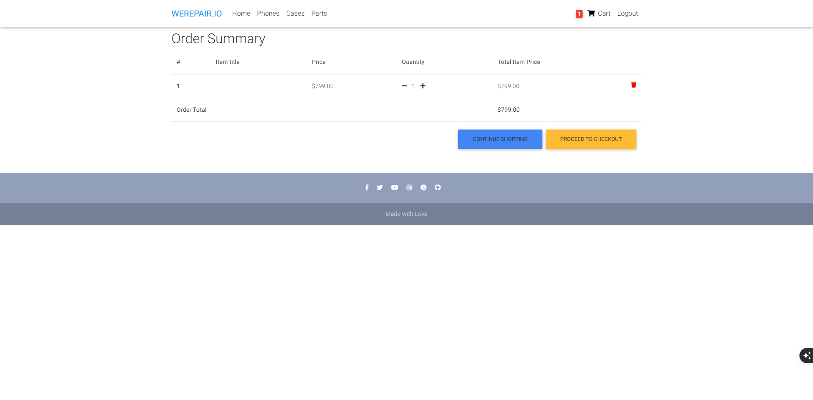

# WEREPAIR.IO

## Description
WEREPAIR.IO is an online platform offering phones, phone cases, and replacement parts. Users can browse through categorized product listings, add items to their cart, and make secure payments.

## Features
- User Authentication (Login & Signup)
- Browse Products by Categories
- Add Products to Cart
- Responsive Design
- Footer with Social Media Links

## Wireframes
### Desktop View
Wireframe illustrating the main product listing page with categories, product cards, and a footer.


### Desktop Cases View


### Desktop Phones View


### Desktop Replacement Parts View


### Tablet View

### Tablet Cases View


### Tablet Phones View


### Tablet Replacement Parts View


### Tablet Home View


### Mobile View


## Lighthouse Results
- **Performance**: 39
- **Accessibility**: 83
- **Best Practices**: 96


## Color Palette
The following colors were used in the website design:

| Element                | Color Code   |
|------------------------|--------------|
| Primary Navbar/Buttons | `#007BFF`    |
| Background             | `#F8F9FA`    |
| Text (Primary)         | `#212529`    |
| Footer Background      | `#6C757D`    |
| Link Hover             | `#0056B3`    |

### Color Palette:


## Deployment
The project is deployed on Render and can be accessed at: [WEREPAIR.IO](https://werepair-io.onrender.com/)

## Installation
1. Clone the repository: `git clone https://github.com/username/werepair-io.git`
2. Navigate to the project directory: `cd werepair-io`
3. Install dependencies: `pip install -r requirements.txt`
4. Run the development server: `python manage.py runserver`

## Testing
### Unit Tests
Run all tests using:
```
python manage.py test
```

### Example Test Results
| Test Suite          | Status |
|---------------------|--------|
| User Authentication | Passed |
| Product Filtering   | Passed |
| Footer Links        | Passed |

## Screenshots
### Home Page


### Phones List Page


### Cases List Page


### Parts List Page


### Sign In Page


### Sign Up Page


### Order Summary Page



### Checkout Page


### Payment Page


## Author
This project was designed and implemented by [Emanuel Caires].

---
Made with 💙 for tech enthusiasts!
