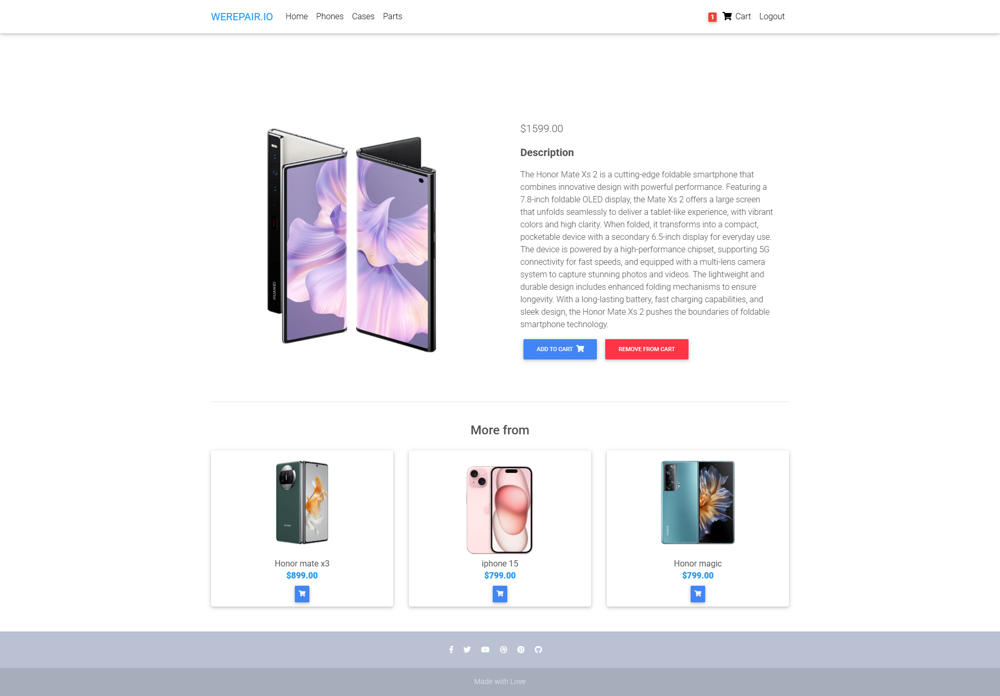

# WEREPAIR.IO

## Description
WEREPAIR.IO is an online platform specializing in selling smartphones, phone cases, and replacement parts. The website provides a seamless shopping experience with categorized product listings, a user-friendly cart system, and secure payment processing. It features a responsive design, ensuring accessibility across desktops, tablets, and mobile devices.

## User Experience (UX)

### Target Audience
Identify the intended users of the platform, such as smartphone users, tech enthusiasts, and individuals looking for replacement parts.

### User Stories
- As a user, I want to easily find and purchase smartphones and accessories.
- As a user, I want to track my orders and receive updates.

### Design Choices
Summarize design decisions, such as color schemes, typography, and layout choices that enhance user experience.

## Features
- **User Authentication**: Secure login and signup functionality.
- **Browse Products by Categories**: Phones, cases, and replacement parts.
- **Add Products to Cart**: Easily add and remove products from the cart.
- **Search and Filtering**: Quick search and advanced filtering options.
- **Order Summary & Checkout**: Review orders before making a purchase.
- **Secure Payments**: Integrated payment gateway for seamless transactions.
- **Mobile-Friendly Design**: Optimized for all screen sizes.
- **Social Media Integration**: Footer with social media links for easy engagement.
- **Performance Optimizations**: Ongoing improvements for faster load times.

## Technologies Used
- **Languages**: Python, JavaScript
- **Frameworks & Libraries**: Django, Bootstrap
- **Tools & APIs**: Git, Render, Stripe API

## Testing
### Manual & Automated Testing
- Ensure all features are tested manually.
- Use automated tests to verify core functionalities.

### Example Test Results
| Test Suite          | Status |
|---------------------|--------|
| User Authentication | Passed |
| Product Filtering   | Passed |
| Footer Links        | Passed |

## Deployment
The project is deployed on Render and can be accessed at: [WEREPAIR.IO](https://werepair-io.onrender.com/)

## Installation
1. Clone the repository: `git clone https://github.com/username/werepair-io.git`
2. Navigate to the project directory: `cd werepair-io`
3. Install dependencies: `pip install -r requirements.txt`
4. Run the development server: `python manage.py runserver`

## Screenshots
### Various Screenshots

    
    
    
    
    
    
    
    
    
    
    

## Author
This project was designed and implemented by Emanuel Caires.

---
Made with 💙 for tech enthusiasts!
